# Housing Blog

This is my fourth project with Code Institute. Housing Blog is an Django blog application which is built for people who are looking for housing designs for their own homes.
The purpose of this site is to allow users to share their home ideas online to other users through, uploading images, commenting on their ideas to help other people and liking other peoples posts.

[Deployed project here]()

## Table of Contents
* [User Experience](#user-experience)
    * [User Stories](#user-stories)
* [Features](#features)
    * [Existing Features](#existing-features)
        * [Navigation Bar](#navigation-bar)
        * [Home page](#home-page)
        * [Sign Up](#sign-up-page)
        * [Sign In page](#sign-in-page)
        * [Sign Out page](#sign-out-page)
        * [Post detail page](#post-detail-page)
        * [Django Admin page](#django-admin-page)
        * [Footer](#footer)
* [Design](#design)
    * [Wireframes](#wireframes)
* [Technologies Used](#technologies-used)
    * [Languages / Frameworks / Libraries / Apps used](#languages--frameworks--libraries--apps-used)
* [Entity Relationship Diagram](#entity-relationship-diagram)
* [Testing](#testing)
    * [Validator Testing](#validator-testing)
    * [Lighthouse](#lighthouse-report)
    * [Manual Testing](#manual-testing)
    * [Solved Issues](#solved-issues)
* [Deployment](#deployment)
    * [ElephantSQL](#elephantsql)
    * [Cloudinary]
    * [Before Deployment]
    * [Heroku]
    * [Forking]
    * [Cloning]
* [Credits](#credits)
    * [Resources Used](#resources-used)
    * [Acknowledgements](#acknowledgements)

## User Experience

### User Stories

    - #### Admin
        - 1. Create drafts:
            - As a **Site Admin** I can **create draft posts** so that **I can finish writing the content later**
        - 2. Manage Posts:
            - As a **Site Admin** I can **create, read, update and delete posts and comments** so that **I can manage my blog content**
        - 3. View likes:
            - As a **Site User / Admin** I can **view the number of likes on each post** so that **I can see which is the most popular or viral**
        - 4. Approve Comments:
            - As a **Site Admin** I can **approve or disapprove comments** so that **I can filter out objectionable comments**
    
    - #### User
        - 1. View post list:
            - As a **Site User** I can **view a list of posts** so that **I can select one to read**
        - 2. Open a post:
            - As a **Site User** I can **click on a post** so that **I can read the full text**
        - 3. Like / unlike:
            - As a **Site User** I can **like or unlike a post** so that **I can interact with the content**
        - 4. View comments:
            - As a **Site User / Admin** I can **view comments on an individual post** so that **I can read the comment somebody has left on a post**
        - 5. Comment on a post:
            - As a **Site User** I can **leave comments on a post** so that **I can be involved in the conversation**
        - 6. View number of comments:
            - As a **Site User / Admin** you can **view the number of comments on each post** so that **I can see which post has how many comments on them**
    
    - #### NewUser
        - 1. Account registration and login:
            - As a **Site User** I can **register an account** so that **I can share my house for people to comment and like**

## Features

### Existing Features

#### Navigation Bar

The navbar has 2 different viewing points. The screenshot below shows the navbar when the user has not signed in to the blog.

This screenshot shows the user is logged in and that if they want too, then they can log out.

#### Home page

The home page shows a family blog page. The only people who can post on this blog are the admins of the site. The reason I have taken this approach is because I wanted this website to be a blog from a family and have people who want to follow their life through the blogs, to comment and like the posts.

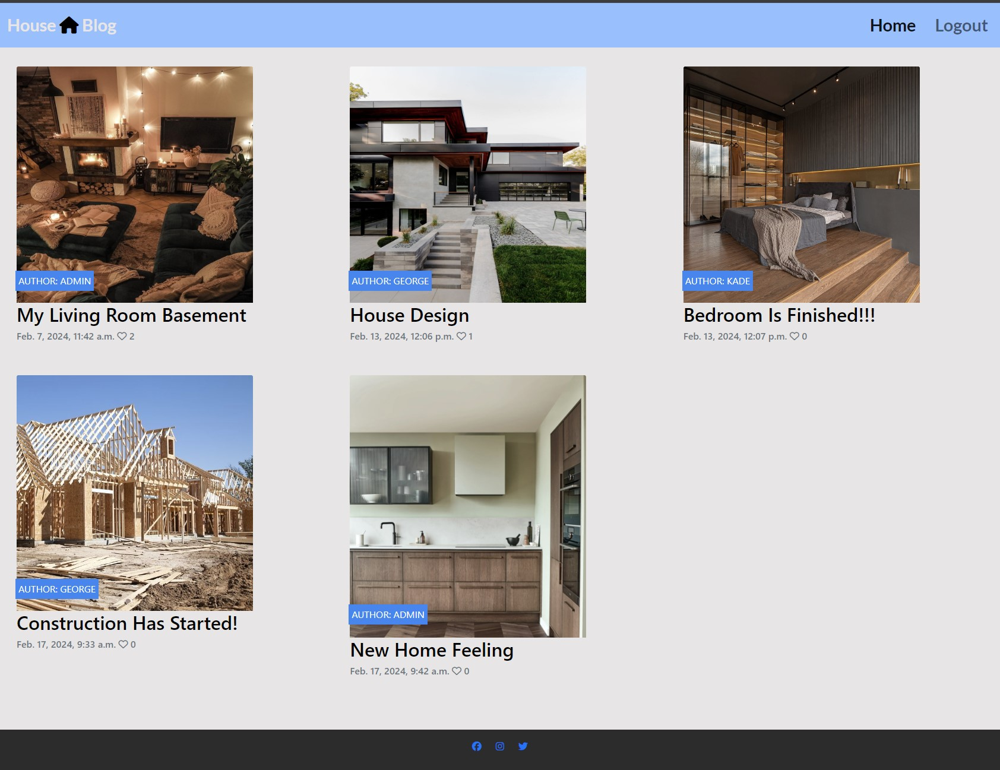

#### Sign Up page

This sign up page shows people having a username, email if they want too input that and also a password with also confirming the password they have chosen.

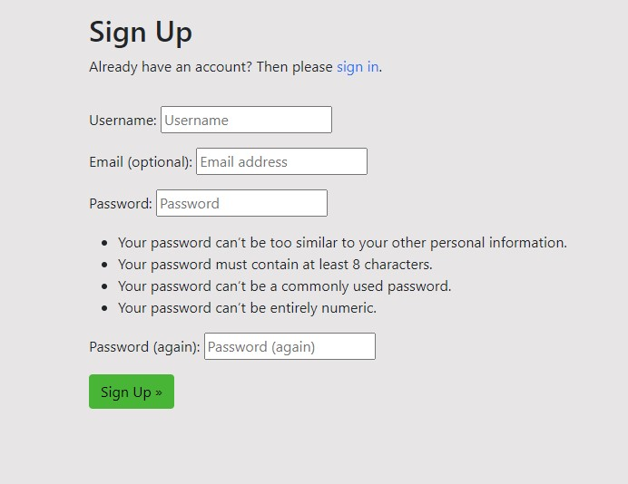

#### Sign In page

The sign in page has a username and password input for them to login. If the person does not have credentials, they can click the sign up link, that will direct them to the sign up page. If the user has forgotten there password, they can click the "Forgot your password?" to then be directed to the Password Reset page.

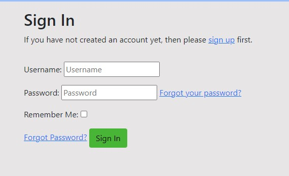

#### Sign Out page

The sign out page is simple and gives a message to the user asking them if they are sure they want to sign out. If so then they would press the "Sign Out" button again.

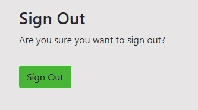

#### Post detail page

The post detail page shows the blog title, the creator and the time that it was posted. If you look under that you will see the description and how many likes and comments there are.

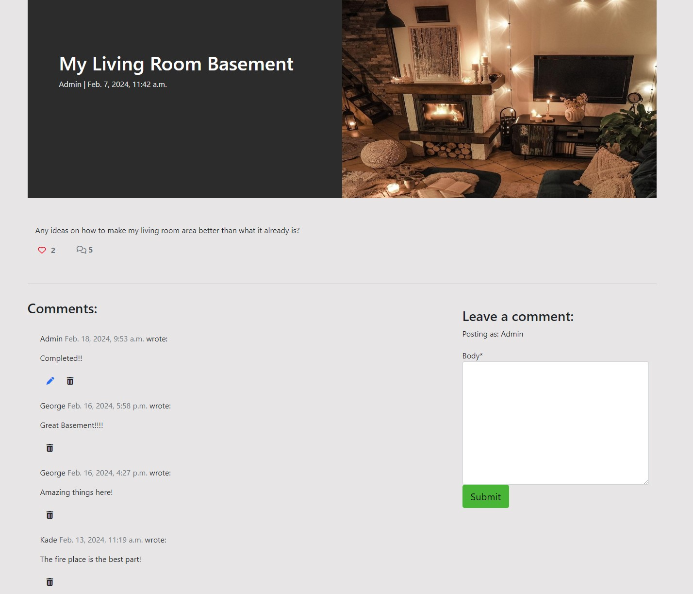

#### Django Admin page

Inside the admin page, this is here so the admin can navigate around easily and they can add the posts, approve comments, delete posts and also do other admin jobs.

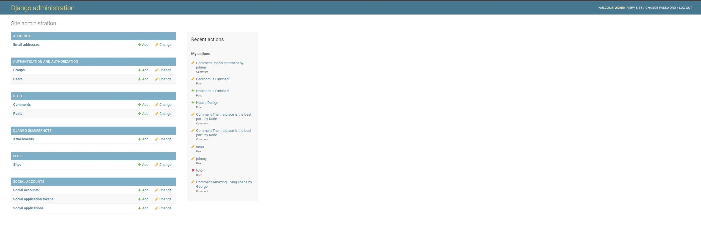

#### Footer

The footer is located at the bottom of the page, this consists of the three social medias that the blog uses to let people know they have posted a new blog. The social medias are Facebook, Instagram and X.

## Design

### Wireframes

At the start of my project I used a website called Figma to plan my website. The wireframes were used to get a basic idea on how the site might look when it is finished.

Home page:

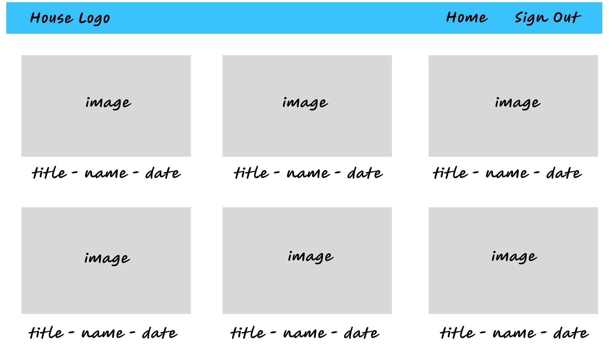

Post Detail page:

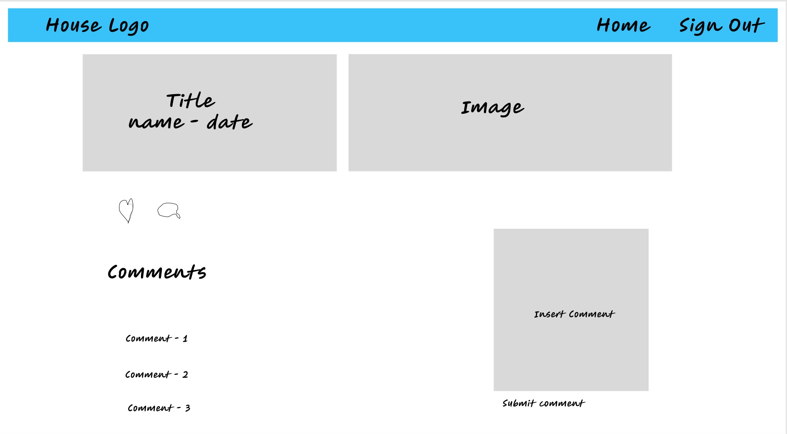

## Technologies Used

### Languages / Frameworks / Libraries / Apps used

    - HTML
    - CSS
    - Javascript
    - Python
    - Django
    - SQL
    - Bootstrap
    - Cloudinary
    - Fontawesome
    - Heroku

## Entity Relationship Diagram

Here I created a ERD for my blog model.

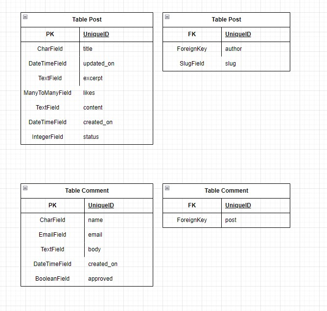

## Testing

### Validator Testing

[W3C HTML Validator](https://validator.w3.org/)

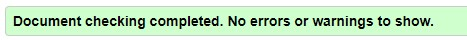

[W3C CSS Validator](https://jigsaw.w3.org/css-validator/)

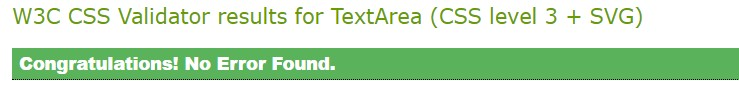

[CI Python Linter](https://pep8ci.herokuapp.com/)

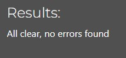

### LightHouse Report

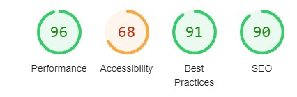

### Manual Testing

| Testcase                                    | Expected Result                                         | Test Result |
|---------------------------------------------|---------------------------------------------------------|-------------|
| Logo is clicked                             | Home page is loaded successfully                        | PASS        |
| Open the Homepage                           | Home page is loaded successfully                        | PASS        |
| Open Post                                   | Post page is loaded successfully                        | PASS        |
| Open Sign Up page                           | Sign Up page is loaded successfully                     | PASS        |
| Open Sign In page                           | Sign In page is loaded successfully                     | PASS        |
| Open Sign Out page                          | Sign Out page is loaded successfully                    | PASS        |
| Open a specific post                        | Specific post is loaded successfully                    | PASS        |
| Register user with valid data               | Request is Successful                                   | PASS        |
| Register user with invalid data             | Request is not Successful                               | PASS        |
| Login user with valid data                  | Request is Successful                                   | PASS        |
| Login user with invalid data                | Request is not Successful                               | PASS        |
| Authenticated user can comment              | Comment body is visible                                 | PASS        |
| Non-Authenticated user can comment          | Comment body is not visible                             | PASS        |
| Authenticated user can edit comment         | User can edit there own comment and not any other users | PASS        |
| Non-Authenticated user can edit comment     | Edit button is not visible                              | PASS        |
| Authenticated user can delete comment       | User can delete there own comment and not anybody else  | PASS        |
| Non-Authenticated user can delete comment   | Delete button is not visible                            | PASS        |
| Try opening a non existing page             | 404 page is loaded successfully                         | PASS        |
| Social Media icons in the footer is clicked | Social media link opens in a new tab                    | PASS        |

### Solved Issues

I was trying to use Javascript to create a edit comment function.
I was unable to get it to work but I came across UpdateView with Django and fixed the issue by implementing that instead.

## Deployment

### ElephantSQL

An external database was created in ElephantSQL using the following steps:
    
1. Log in to ElephantSQL and select 'Create New Instance'.
2. Select a plan, input your details and review.
3. Once created, use the copy icon to copy the DATABASE_URL

### Cloudinary

Cloudinary was used to store static and media files:

1. Log in to Cloudinary
2. Copy your CLOUDINARY_URL

### Before Deployment

Important things to do before deployment:

1. The requirements for the project were added to a requirements.txt using the command 'pip3 freeze > requirements.txt' in the terminal.
2. Inside .gitignore file, include env.py to ensure sensitive information is not pushed to GitHub.
3. In settings.py, set 'DEBUG = False' to prevent verbose error pages and Django serving static files itself instead of replying on Cloudinary.
4. in settings.py, link SECRET_KEY to the env.py file where the secret key is defined.

### Heroku

Heroku is where the app will be deployed to. Follow these steps:

1. Log in to Heroku and select 'Create New App'
2. Create a unique name for your app and select your location.
3. Open the settings tab, go to the 'Reveal Config Vars' and set the Config Vars for deployment.

Config Vars for deployment:

- DATABASE_URL
- SECRET_KEY
- CLOUDINARY_URL

4. Select the Deploy tab and connect your github repo to this if you have not done already.
5. Scroll to the bottom of the deploy tab and 'Deploy Branch'.
6. Click 'View' to open the deployed app.

### Forking

1. Inside the GitHub repo, click on 'Fork' and then 'Create a Fork'.
2. Change the name and description of the fork.
3. Then copy only the main branch or all branches.
4. 'Create a Fork' and a new repo will appear in your GitHub.

### Cloning

1. Inside the GitHub repository, click 'Code' and copy the link provided.
2. Open git bash and change the working directory to the location you want.
3. Then use 'git clone' and paste the link. All done. 

## Credits

### Resources Used

Code Institute - I THINK THEREFORE I BLOG

UpdateView - https://www.geeksforgeeks.org/updateview-class-based-views-django/?ref=lbp

Used for Wireframes - https://www.figma.com/

### Acknowledgements

Big Thank you to Brian, my mentor for helping me and guiding me through the project.
