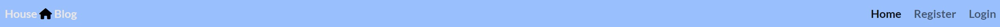
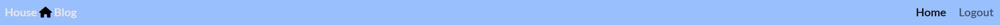

# Housing Blog

This is my fourth project with Code Institute. Housing Blog is an Django blog application which is built for people who are looking for housing designs for their own homes.
The purpose of this site is to allow users to share their home ideas online to other users through, uploading images, commenting on their ideas to help other people and liking other peoples posts.

[Deployed project here]()

## Table of Contents
* [User Experience](#user-experience)
    * [User Stories](#user-stories)
    * [Strategy](#strategy)
    * [Project Goals](#project-goals)
* [Features](#features)
    * [Existing Features](#existing-features)
        * [Navigation Bar](#navigation-bar)
        * [Home page](#home-page)
        * [Register page](#register-page)
        * [Login page](#login-page)
        * [Logout page](#logout-page)
        * [Profile page](#profile-page)
        * [Post detail page](#post-detail-page)
        * [Django Admin page](#django-admin-page)
        * [Footer](#footer)
* [Design](#design)
    * [Wireframes](#wireframes)
* [Technologies Used](#technologies-used)
    * [Languages Used](#languages-used)
    * [Frameworks and Libraries used](#frameworks-and-libraries-used)
    * [Applications used](#applications-used)
* [Testing](#testing)
    * [Validator Testing](#validator-testing)
    * [Automated Testing](#automated-testing)
    * [Responsiveness](#responsiveness)
    * [Browser Testing](#browser-testing)
    * [Solved bugs](#solved-bugs)
    * [Known bugs](#known-bugs)
* [Deployment](#deployment)
* [Credits](#credits)
    * [Acknowledgements](#acknowledgements)

## User Experience

### User Stories

    - #### Admin
        - 1. Create drafts:
            - As a **Site Admin** I can **create draft posts** so that **I can finish writing the content later**
        - 2. Manage Posts:
            - As a **Site Admin** I can **create, read, update and delete posts and comments** so that **I can manage my blog content**
        - 3. View likes:
            - As a **Site User / Admin** I can **view the number of likes on each post** so that **I can see which is the most popular or viral**
        - 4. Approve Comments:
            - As a **Site Admin** I can **approve or disapprove comments** so that **I can filter out objectionable comments**
    
    - #### User
        - 1. View post list:
            - As a **Site User** I can **view a list of posts** so that **I can select one to read**
        - 2. Open a post:
            - As a **Site User** I can **click on a post** so that **I can read the full text**
        - 3. Like / unlike:
            - As a **Site User** I can **like or unlike a post** so that **I can interact with the content**
        - 4. View comments:
            - As a **Site User / Admin** I can **view comments on an individual post** so that **I can read the comment somebody has left on a post**
        - 5. Comment on a post:
            - As a **Site User** I can **leave comments on a post** so that **I can be involved in the conversation**
        - 6. View number of comments:
            - As a **Site User / Admin** you can **view the number of comments on each post** so that **I can see which post has how many comments on them**
    
    - #### NewUser
        - 1. Account registration and login:
            - As a **Site User** I can **register an account** so that **I can share my house for people to comment and like**

## Features

### Existing Features

#### Navigation Bar

The navbar has 2 different viewing points. The screenshot below shows the navbar when the user has not signed in to the blog.

This screenshot shows the user is logged in and that if they want too, then they can log out.

#### Home page

The home page shows a family blog page. The only people who can post on this blog are the admins of the site. The reason I have taken this approach is because I wanted this website to be a blog from a family and have people who want to follow their life through the blogs, to comment and like the posts.

#### Sign Up page

This sign up page shows people having a username, email if they want too input that and also a password with also confirming the password they have chosen.

#### Sign In page

The sign in page has a username and password input for them to login. If the person does not have credentials, they can click the sign up link, that will direct them to the sign up page. If the user has forgotten there password, they can click the "Forgot your password?" to then be directed to the Password Reset page.

#### Sign Out page

The sign out page is simple and gives a message to the user asking them if they are sure they want to sign out. If so then they would press the "Sign Out" button again.

#### Post detail page

The post detail page shows the blog title, the creator and the time that it was posted. If you look under that you will see the description and how many likes and comments there are.

#### Django Admin page

Inside the admin page, this is here so the admin can navigate around easily and they can add the posts, approve comments, delete posts and also do other admin jobs.

#### Footer

The footer is located at the bottom of the page, this consists of the three social medias that the blog uses to let people know they have posted a new blog. The social medias are Facebook, Instagram and X.

## Design

### Wireframes

At the start of my project I used a website called Figma to plan my website. The wireframes were used to get a basic idea on how the site might look when it is finished.

Home page:

Post Detail page:

## Technologies Used

### Languages / Frameworks / Libraries / Apps used

    - HTML
    - CSS
    - Javascript
    - Python
    - Django
    - SQL
    - Bootstrap
    - Cloudinary
    - Fontawesome
    - Heroku

## Testing

### Validator Testing

### Automated Testing

### Responsiveness

### Browser Testing

### Solved bugs

### Known bugs

## Deployment

## Credits

### Acknowledgements
